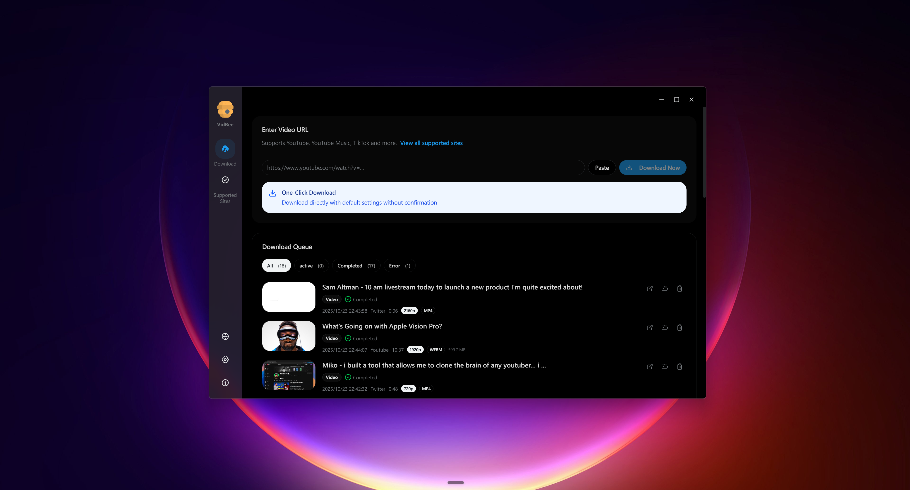
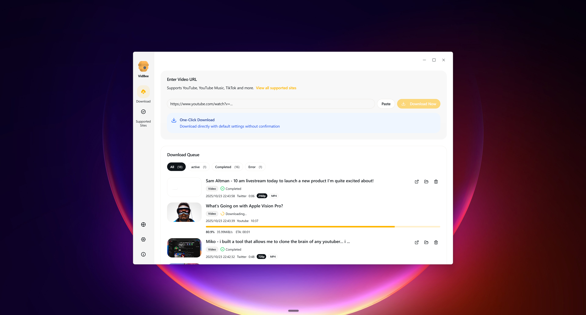

<div align="left">
  <a href="https://github.com/Jacobgg994/VidBee">
    
  </a>

  <h3>VidBee</h3>
  <p>
    <a href="https://github.com/Jacobgg994/VidBee/stargazers"></a>
    <br />
    <br />
    <a href="https://github.com/Jacobgg994/VidBee/releases/latest" target="_blank"></a>
    <a href="https://github.com/Jacobgg994/VidBee/releases/latest" target="_blank"></a>
    <br />
    <br />
  </p>
</div>

**VidBee** คือโปรแกรมดาวน์โหลดวิดีโอโอเพนซอร์ซที่ทันสมัย ช่วยให้คุณดาวน์โหลดวิดีโอและเสียงจากเว็บไซต์ต่างๆ กว่า 1,000 แห่งทั่วโลก พัฒนาด้วย Electron และขับเคลื่อนด้วยขุมพลังของ yt-dlp โดย VidBee มาพร้อมกับอินเทอร์เฟซที่สะอาดตา ใช้งานง่าย และฟีเจอร์ที่ทรงพลัง รวมถึงระบบดาวน์โหลดอัตโนมัติผ่าน RSS ที่ช่วยให้คุณติดตามและดาวน์โหลดวิดีโอใหม่ๆ จากครีเอเตอร์ที่คุณชื่นชอบได้ทันทีในพื้นหลัง

## 🚀 เริ่มต้นใช้งาน

VidBee อยู่ระหว่างการพัฒนาอย่างต่อเนื่อง และเรายินดีรับฟังข้อเสนอแนะผ่าน [Issue](https://github.com/Jacobgg994/VidBee/issues) ครับ

[📥 ดาวน์โหลด VidBee](https://vidbee.org/download/) | [📚 เอกสารประกอบการใช้งาน](https://docs.vidbee.org)

## ✨ คุณสมบัติเด่น

### 🌍 รองรับการดาวน์โหลดวิดีโอจากทั่วโลก
ดาวน์โหลดวิดีโอจากแทบทุกเว็บไซต์ทั่วโลกผ่านเอนจิน yt-dlp ที่ทรงพลัง รองรับกว่า 1,000 ไซต์ รวมถึง YouTube, TikTok, Instagram, Twitter และอื่นๆ อีกมากมาย


### 🎨 ประสบการณ์ UI ที่ดีที่สุด
อินเทอร์เฟซที่ทันสมัย สะอาดตา และใช้งานง่าย สามารถกดหยุด/เริ่มต่อ/ลองใหม่ได้ในคลิกเดียว พร้อมการติดตามความคืบหน้าแบบเรียลไทม์ และระบบจัดการคิวการดาวน์โหลดที่ครอบคลุม


### 📡 ดาวน์โหลดอัตโนมัติผ่าน RSS
สมัครรับข้อมูล RSS และดาวน์โหลดวิดีโอใหม่ๆ ในพื้นหลังโดยอัตโนมัติจากครีเอเตอร์คนโปรดของคุณใน YouTube, TikTok และแพลตฟอร์มอื่นๆ ตั้งค่าเพียงครั้งเดียว VidBee จะจัดการดาวน์โหลดวิดีโอใหม่ให้เองโดยไม่ต้องกดมือ

## 🧩 เว็บไซต์ที่รองรับ
VidBee รองรับแพลตฟอร์มวิดีโอและเสียงกว่า 1,000 แห่งผ่าน yt-dlp สามารถดูรายชื่อเว็บไซต์ที่รองรับทั้งหมดได้ที่ [https://vidbee.org/supported-sites/](https://vidbee.org/supported-sites/)

## 🏗️ โครงสร้าง Monorepo
โปรเจกต์นี้ประกอบด้วย:
- `apps/desktop`: แอปพลิเคชัน VidBee สำหรับเดสก์ท็อป (Electron)
- `apps/api`: เซิร์ฟเวอร์ API (Fastify)
- `apps/web`: เว็บไซต์ลูกข่าย (TanStack Start)
- `apps/extension`: ส่วนขยายเบราว์เซอร์ (WXT)

## 🐳 การใช้งานด้วย Docker
คุณสามารถรัน VidBee ผ่าน Docker Compose ได้ง่ายๆ:
```bash
docker compose up -d --build
```

## 📜 ใบอนุญาต (License)
โปรเจกต์นี้เผยแพร่ภายใต้ใบอนุญาต MIT ดูรายละเอียดได้ที่ไฟล์ [`LICENSE`](LICENSE)

## 🙏 ขอบคุณ
- [yt-dlp](https://github.com/yt-dlp/yt-dlp) - เอนจินดาวน์โหลดวิดีโอที่ทรงพลัง
- [FFmpeg](https://ffmpeg.org/) - เฟรมเวิร์กมัลติมีเดียสำหรับการประมวลผลวิดีโอและเสียง
- [Electron](https://www.electronjs.org/) - สำหรับสร้างแอปเดสก์ท็อป
- [React](https://react.dev/) & [Tailwind CSS](https://tailwindcss.com/) - สำหรับส่วนติดต่อผู้ใช้
